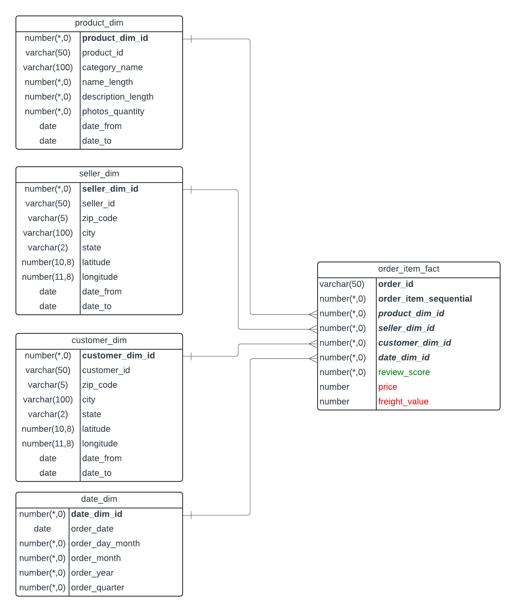

# Data Mart design

1. Business process - ordering, central OLTP table is `order_item`;
2. Granularity - every order item separately;
3. Dimension tables - `product_dim`, `seller`, `customer`, `date`;
4. Fact table - `order_item_fact`;

DDL statements [here](./data_mart_ddl.sql);

